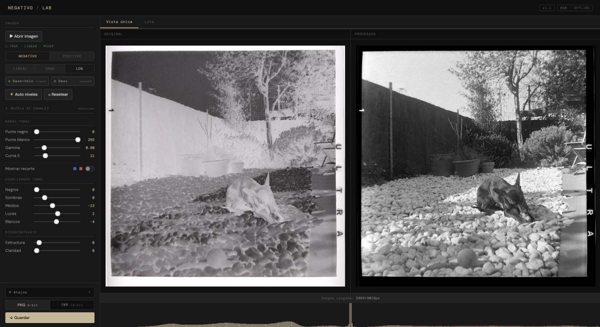
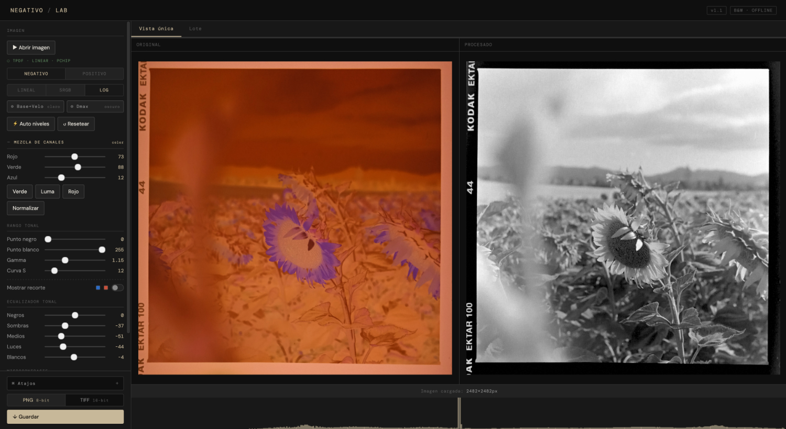

# Negativo Lab

A single-HTML, offline B&W darkroom for scanned negatives and positives.
No install, no build, no dependencies, no network. Download, double-click, done.

*Un único HTML, offline, para revelar negativos y positivos B&W escaneados.
Sin instalación, sin build, sin dependencias, sin red. Descargar, doble clic, listo.*

---

## English

| B&W negative | Color negative (channel mixer) |
|:---:|:---:|
|  |  |

### What it is

Negativo Lab turns scanned film into finished images, entirely in your browser.
Built as a companion to a basic 8-bit RGB scanner, focused on monochrome work:
B&W negatives, B&W positives, and color negatives or toned scans rendered as B&W.

The develop pipeline is always monochrome. What the **channel mixer** adds is
control over *which* chromatic information from the scan feeds the gray — pull
the red channel to lift skies, use perceptual luma, etc. — which is exactly what
you want for a color negative or a sepia/cyan-toned scan. It does not produce a
color image; it gives you a better gray to develop.

End-to-end Float32 pipeline. PCHIP-monotone tonal equalizer. Honest sRGB
transfer curves (not γ≈2.2 approximations). TPDF dithered 8-bit output and
optional 16-bit TIFF with Deflate + horizontal predictor — written from
scratch, no external libs.

> **v1.1** — adds the RGB→gray channel mixer for color negatives and toned
> scans, plus automatic color/monochrome detection. The default mix is the
> pure green channel, bit-for-bit identical to previous behavior: with nothing
> touched, nothing changes. See [Releases](../../releases) for the full changelog.

### How to use

1. Download `negativo_lab.html`.
2. Open it in any modern browser (double-click works).
3. Drag your scan onto the window, or use **Open image**.
4. Pick **Negative** or **Positive** and a sub-mode (see below).
5. For a color negative or toned scan, set the **channel mix** (R/G/B weights
   or a preset) to decide which chromatic info feeds the gray. For a neutral
   B&W scan you can leave it on the green-channel default.
6. Adjust levels, gamma, the 5-zone tonal equalizer, structure and clarity.
7. **Save** as PNG 8-bit (default) or TIFF 16-bit.

For batches: drop several files at once, or open the **Batch** tab. Current
settings — including the channel mix — are applied to all images.

### Key features

- **Single HTML file.** No install, no build step, no package manager.
  Works offline from `file://`.
- **Float32 pipeline end-to-end.** Inversion, levels, gamma, tonal curve and
  microcontrast all happen in 32-bit float before quantization.
- **RGB→gray channel mixer.** Develop color negatives and toned scans by
  choosing which chromatic channels feed the gray (R/G/B weights, % scale,
  with Green / Luma / Red / Normalize presets). Default is pure green,
  identical to plain grayscale conversion. Mix happens in perceptual sRGB,
  the convention of photographic channel mixers.
- **Automatic color/monochrome detection.** Measures chromatic variation
  (robust against sepia/cyan toning, not just a global cast) to decide whether
  the mixer panel opens expanded, and shows a *color* / *monochrome* badge.
- **Two input types, multiple inversion models.** Negative (linear / sRGB /
  log) and Positive (linear / auto-normalize). Each remembers its last
  sub-mode independently.
- **Eyedropper calibration.** Pick Base+Fog and Dmax directly from the image
  to set the tonal range manually. Live tooltip with linear value and log
  density. Persistent SVG markers.
- **5-zone tonal equalizer with monotone PCHIP interpolation.** Guaranteed
  no tonal inversions, however far you push the sliders.
- **Structure & clarity in perceptual sRGB**, not linear light. Predictable,
  symmetric behavior in shadows and highlights.
- **Honest export.** PNG 8-bit with TPDF dither (default) or 16-bit grayscale
  TIFF with Deflate + horizontal predictor, written by hand without external
  libraries.
- **Batch processing** with a single pipeline pass per image and live
  thumbnails derived from the same Float32 that gets exported. Inherits the
  current channel mix.
- **Undo / redo** (30-step history with slider coalescing — dragging a slider
  leaves one snapshot, not fifty). The channel mix is part of the history.
- **Keyboard shortcuts** covering file, view, tools, sliders (mix sliders
  included) and history. Full reference in the collapsible ⌘ panel inside the
  sidebar.
- **Fast blurs.** Structure and clarity use a 3-pass separable box-blur
  approximation (Wells 1986) instead of a true Gaussian. Full pipeline on a
  12 MP image with both active: ~4 s instead of ~33 s. Perceptual error
  vs. exact Gaussian: rms < 3 LSB (indistinguishable).

### Keyboard shortcuts

| Key | Action |
|-----|--------|
| `O` | Open image |
| `S` | Save (single view) |
| `⇧S` | Toggle PNG ↔ TIFF |
| `1` / `2` | Single / Batch view |
| `N` / `P` | Negative / Positive |
| `B` | Base+Fog eyedropper |
| `D` | Dmax eyedropper |
| `C` | Toggle clipping overlay |
| `A` | Auto levels |
| `R` | Reset all |
| `Esc` | Cancel eyedropper |
| `← →` | ±1 on focused slider (mix sliders included) |
| `⇧← ⇧→` | ±10 on focused slider |
| `0` | Reset focused slider to default |
| `Z` / `⇧Z` | Undo / Redo |

### Modes at a glance

**Negative:**
- *Linear* — `1−x` in linear light. Attenuator model. Crushes highlights.
- *sRGB* (default) — `1−x` in perceptual sRGB. Sensible compromise.
- *Log* — log-density auto-stretch from the scan's actual range
  (0.5% / 99.5% percentiles). Closest to the photochemical process.

**Positive:**
- *Linear* (default) — no pre-transform. Pure B&W editor.
- *Normalize* — same log auto-stretch, without inversion. Useful for flat
  or underexposed positives.

### Limitations

- Input is 8-bit per channel. The browser's `` quantizes 16-bit PNG/TIFF
  scans on load, so even with a 16-bit source, the effective input is 8-bit.
  The Float32 pipeline still benefits the *output*: TPDF dither breaks
  banding, and the 16-bit TIFF export preserves precision for downstream
  editing.
- **Monochrome output.** The develop pipeline always collapses to gray. The
  channel mixer lets you handle color negatives and toned scans by choosing
  which chromatic information feeds that gray, but the result is a B&W image —
  the app does not produce color output.
- The UI is currently in Spanish.
- The page loads DM Sans and DM Mono from Google Fonts on first visit. After
  that the browser caches them and the app runs fully offline. If you want
  zero-network from the very first load, delete the `<link>` tag in `<head>`
  and the app will fall back to system fonts.

### License

MIT. See [LICENSE](LICENSE).

---

## Español

| Negativo B&N | Negativo a color (mezcla de canales) |
|:---:|:---:|
|  |  |

### Qué es

Negativo Lab convierte negativos escaneados (o positivos) en imágenes
finales, todo en el navegador. Pensado como complemento a un escáner sencillo
RGB 8-bit, centrado en blanco y negro: negativos B&W, positivos B&W y
negativos color o scans virados revelados como B&W.

El pipeline de revelado es siempre monocromo. Lo que añade la **mezcla de
canales** es controlar *qué* información cromática del scan alimenta el gris
—tirar del canal rojo para realzar cielos, usar luma perceptual, etc.—, que es
justo lo que necesitas para un negativo a color o un scan virado (sepia, cian).
No genera una imagen en color; te da un gris mejor para revelar.

Pipeline Float32 de extremo a extremo. Ecualizador tonal con interpolación
PCHIP monótona. Curvas sRGB reales (no aproximaciones γ≈2.2). Salida 8-bit
con dither TPDF y opción de TIFF 16-bit con Deflate + predictor horizontal —
escrito a mano, sin librerías externas.

> **v1.1** — añade la mezcla de canales RGB→gris para negativos a color y
> scans virados, más la detección automática color/monocromo. La mezcla por
> defecto es el canal verde puro, idéntica bit a bit al comportamiento
> anterior: sin tocar nada, nada cambia. Changelog completo en
> [Releases](../../releases).

### Cómo usarlo

1. Descarga `negativo_lab.html`.
2. Ábrelo en cualquier navegador moderno (doble clic vale).
3. Arrastra tu scan a la ventana, o usa **Abrir imagen**.
4. Elige **Negativo** o **Positivo** y un sub-modo (ver abajo).
5. Para un negativo a color o un scan virado, ajusta la **mezcla de canales**
   (pesos R/G/B o un preset) para decidir qué información cromática alimenta el
   gris. Para un scan B&W neutro puedes dejar el default de canal verde.
6. Ajusta niveles, gamma, el ecualizador tonal de 5 zonas, structure y
   clarity.
7. **Guarda** como PNG 8-bit (por defecto) o TIFF 16-bit.

Para lotes: suelta varios archivos a la vez, o abre la pestaña **Lote**. Los
ajustes actuales —incluida la mezcla de canales— se aplican a todas las
imágenes.

### Características principales

- **Un único archivo HTML.** Sin instalación, sin build, sin gestor de
  paquetes. Funciona offline desde `file://`.
- **Pipeline Float32 de extremo a extremo.** Inversión, niveles, gamma,
  curva tonal y microcontraste se procesan en coma flotante 32-bit antes de
  la cuantización final.
- **Mezcla de canales RGB→gris.** Revela negativos a color y scans virados
  eligiendo qué canales alimentan el gris (pesos R/G/B en %, con presets
  Verde / Luma / Rojo / Normalizar). El default es verde puro, idéntico a la
  conversión a gris clásica. La mezcla ocurre en sRGB perceptual, la
  convención de los channel mixers fotográficos.
- **Detección automática color/monocromo.** Mide la variación cromática
  (robusta frente a virados sepia/cian, no solo una dominante global) para
  decidir si el panel de mezcla arranca desplegado, y muestra un badge
  *color* / *monocromo*.
- **Dos tipos de entrada con varios modelos de inversión.** Negativo
  (lineal / sRGB / log) y Positivo (lineal / auto-normalizar). Cada uno
  recuerda su último sub-modo de forma independiente.
- **Calibración con cuentagotas.** Selecciona Base+Fog y Dmax directamente
  sobre la imagen para fijar el rango tonal manualmente. Tooltip en vivo
  con valor lineal y densidad log. Marcadores SVG persistentes.
- **Ecualizador tonal de 5 zonas con interpolación PCHIP monótona.**
  Garantía: no produce inversiones tonales por mucho que se muevan los
  sliders.
- **Structure y clarity en sRGB perceptual**, no en luz lineal.
  Comportamiento predecible y simétrico en sombras y luces.
- **Exportación honesta.** PNG 8-bit con dither TPDF (por defecto) o TIFF
  grayscale 16-bit con Deflate + predictor horizontal, escrito a mano sin
  dependencias.
- **Procesamiento por lotes** con una sola pasada del pipeline por imagen y
  miniaturas derivadas del mismo Float32 que se exporta. Hereda la mezcla de
  canales actual.
- **Historial undo/redo** de 30 pasos con coalescencia de sliders: arrastrar
  un slider deja un único snapshot, no cincuenta. La mezcla de canales forma
  parte del historial.
- **Atajos de teclado** para archivo, vista, herramientas, sliders (incluidos
  los de mezcla) e historial. Referencia completa en el panel ⌘ colapsable del
  sidebar.
- **Blurs rápidos.** Structure y clarity usan una aproximación por 3 box-blurs
  separables (Wells 1986) en lugar de un gaussiano exacto. Pipeline completo
  en 12 MP con ambos activos: ~4 s en vez de ~33 s. Error perceptual frente
  al gaussiano exacto: rms < 3 LSB (imperceptible).

### Atajos de teclado

| Tecla | Acción |
|-------|--------|
| `O` | Abrir imagen |
| `S` | Guardar (vista única) |
| `⇧S` | Alternar PNG ↔ TIFF |
| `1` / `2` | Vista única / Lote |
| `N` / `P` | Negativo / Positivo |
| `B` | Cuentagotas Base+Fog |
| `D` | Cuentagotas Dmax |
| `C` | Mostrar clipping |
| `A` | Auto niveles |
| `R` | Resetear todo |
| `Esc` | Cancelar cuentagotas |
| `← →` | ±1 al slider con foco (incluidos los de mezcla) |
| `⇧← ⇧→` | ±10 al slider con foco |
| `0` | Resetear ese slider al default |
| `Z` / `⇧Z` | Deshacer / Rehacer |

### Modos de un vistazo

**Negativo:**
- *Lineal* — `1−x` en luz lineal. Modelo atenuador. Aplasta luces.
- *sRGB* (por defecto) — `1−x` en sRGB perceptual. Compromiso razonable.
- *Log* — auto-stretch logarítmico del rango real del scan
  (percentiles 0.5% / 99.5%). El más fiel al proceso fotoquímico.

**Positivo:**
- *Lineal* (por defecto) — sin transformación previa. Editor B&W puro.
- *Normalizar* — el mismo auto-stretch logarítmico, sin invertir. Útil
  para positivos planos o subexpuestos.

### Limitaciones

- La entrada es 8 bits por canal. El `` del navegador cuantiza los PNG
  y TIFF de 16 bits al cargarlos, así que aunque el scan sea de 16 bits, la
  entrada efectiva es 8 bits. El pipeline Float32 sigue beneficiando a la
  *salida*: el dither TPDF rompe el banding, y la exportación TIFF 16-bit
  preserva precisión para edición posterior.
- **Salida monocroma.** El pipeline de revelado siempre colapsa a gris. La
  mezcla de canales permite manejar negativos a color y scans virados
  eligiendo qué información cromática alimenta ese gris, pero el resultado es
  una imagen B&W — la app no produce salida en color.
- La UI está actualmente en español.
- La página carga DM Sans y DM Mono desde Google Fonts en la primera visita.
  A partir de ahí el navegador las cachea y la app funciona offline al 100%.
  Si quieres cero red desde el primer arranque, borra la etiqueta `<link>`
  del `<head>` y la app caerá a las fuentes del sistema.

### Licencia

MIT. Ver [LICENSE](LICENSE).
